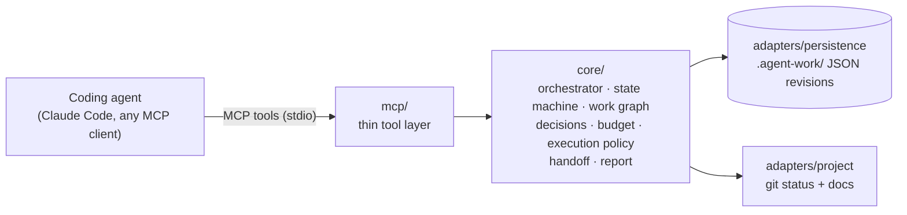
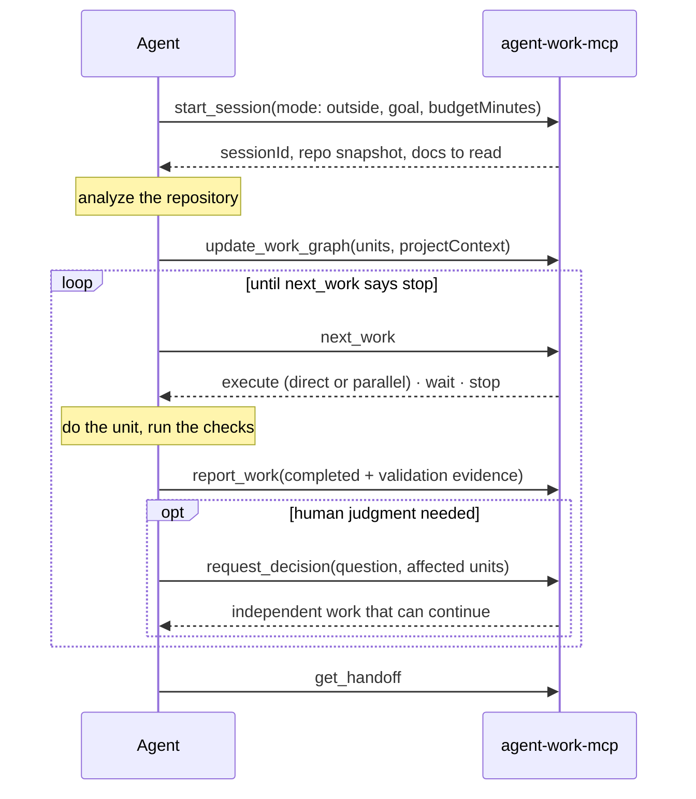
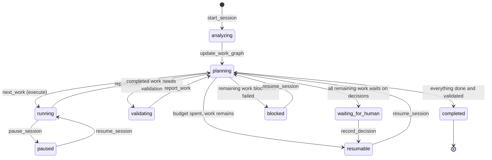

# agent-work-mcp

**Let your coding agent work for hours while you're away, and come back to a clean handoff.**

`agent-work-mcp` is a [Model Context Protocol](https://modelcontextprotocol.io) server that
orchestrates agent work. It gives a coding agent (Claude Code, or any MCP client) a
persistent **work session** with a **time budget**, a **dependency graph** of work, a
**human decision queue**, required **validation**, and an exact **handoff**.


It has two modes:

- **OUTSIDE_MODE**: bounded autonomous execution, for when you are away. The agent owns
  the phase goal until the budget is spent or no meaningful executable work remains. It
  never stops to ask you a question. It records the question, parks the work that
  depends on the answer, and keeps going with everything else.
- **DESK_MODE**: human-in-the-loop execution, for when you are back. You start from the
  handoff, answer the queued decisions (most blocking first), and resume in either mode.

> **Status: v0.1.** The core session lifecycle is implemented and tested end to end:
> 218 tests, covering the MCP boundary and the built binary over stdio. It is not yet
> published to npm. GitHub and Todoist integrations are deliberately not part of v0.1.

---

## Contents

- [Why](#why)
- [How it works](#how-it-works)
- [Guarantees](#guarantees)
- [Install](#install)
- [Connect it to your agent](#connect-it-to-your-agent)
- [Using OUTSIDE_MODE](#using-outside_mode)
- [Using DESK_MODE](#using-desk_mode)
- [What a handoff looks like](#what-a-handoff-looks-like)
- [Concepts](#concepts)
- [Tools](#tools)
- [Configuration and storage](#configuration-and-storage)
- [Using the core as a library](#using-the-core-as-a-library)
- [Development](#development)
- [Limitations](#limitations)
- [Roadmap](#roadmap)
- [Documentation](#documentation)
- [License](#license)

---

## Why

Coding agents are good at individual tasks and bad at owning an outcome over several
hours without supervision. The failure modes are predictable:

- **Stopping too early.** The agent finishes one task and ends its turn, although the
  budget and plenty of work remain.
- **Blocking on questions.** It asks "JWT or sessions?" and then waits hours for an answer
  nobody is there to give.
- **Guessing instead.** It makes an architectural or product decision on its own.
- **Busywork.** It invents work to fill the time it was given.
- **Unverified "done".** It declares work finished without checking it.
- **Lost context.** It crashes or runs out of context and leaves no record of where it was.

`agent-work-mcp` moves the parts an agent can't hold reliably in its context window into a
small, persistent control plane, and enforces the rules on the server rather than only in
a prompt.

## How it works

The server is a **control plane**. It does not run models or edit files. Your agent is the
**execution plane**: it reads the code, makes changes, runs tests, and spawns its own
subagents. The agent pulls work from the server and reports back.



The OUTSIDE loop, from the agent's point of view:



Session states (simplified; the full transition table is in
[docs/state-model.md](docs/state-model.md)):



## Guarantees

These rules are enforced by the server, not just stated in a prompt.

| Rule | How it is enforced |
|---|---|
| A finished task never ends the run | `report_work` never halts a session; it moves it back to `planning` and tells the agent to call `next_work`. Only a `stop` from `next_work` ends a run. |
| The budget is for the session, not per task | A 4-hour unit may use 4 hours of a 5-hour budget; a 20-minute unit takes 20 minutes and the next work is picked. Estimates never consume budget; only elapsed time does. |
| Never invent work to use up budget | Units added after the initial plan need a rationale and appear in the report as mid-session scope. Unused budget is reported as a normal outcome. |
| Never invent decisions | `record_decision` is refused while an OUTSIDE run is active. Removing a decision gate from a unit, or cancelling work that waits on an open decision, is refused too. |
| Decisions don't stop independent work | A decision gates only its affected units and their dependents. The run halts as `waiting_for_human` only when *all* remaining work waits on a human. |
| Parallelism must be earned | Subagents are used only for provably isolated units whose time savings beat the overhead. Remaining budget is not an input: more budget never means more agents. |
| Smaller verified change over speculation | Completing a unit requires validation evidence. Before halting with unvalidated work, an integration validation unit runs. |
| Survive interruption | State is written as immutable revision files with an atomic compare-and-swap that is safe across processes. Recovery restores in-flight units from their checkpoints. |

## Install

Requirements: Node.js 20 or newer, and an MCP client.

```bash
git clone https://github.com/yurikaza/agent-work-mcp.git
```

```bash
cd agent-work-mcp && npm install && npm run build
```

This produces `dist/cli.js`, a stdio MCP server. Check it:

```bash
node dist/cli.js --version
```

## Connect it to your agent

### Claude Code

Run this inside the project you want the agent to work on. The `local` scope keeps the
registration private to you and to that project, so no machine-specific paths end up in the
project's repository.

```bash
claude mcp add agent-work --scope local -e AGENT_WORK_PROJECT_ROOT="$PWD" -- node /absolute/path/to/agent-work-mcp/dist/cli.js
```

Verify:

```bash
claude mcp get agent-work
```

If your Claude Code is launched from a GUI with a minimal `PATH`, use the absolute path to
`node` (`which node`) instead of `node`. Start a new Claude Code session afterwards: sessions
that were already open do not pick up new servers.

### Other MCP clients

Most clients accept an `mcpServers` entry like this:

```json
{
  "mcpServers": {
    "agent-work": {
      "command": "node",
      "args": ["/absolute/path/to/agent-work-mcp/dist/cli.js"],
      "env": { "AGENT_WORK_PROJECT_ROOT": "/absolute/path/to/your/project" }
    }
  }
}
```

The server speaks the MCP `2026-07-28` revision and also serves clients that open with the
2025-era `initialize` handshake.

## Using OUTSIDE_MODE

Before you leave, ask your agent something like:

> Start an agent-work OUTSIDE session. Goal: "finish team invitations (phase 2)". Budget:
> 180 minutes. Exit criteria: "invites can be sent and accepted". Constraint: "don't touch
> billing". Follow next_work until it says stop, then give me the handoff.

What happens:

1. **`start_session`** creates the session and returns a `sessionId`, a git snapshot
   (branch, head, uncommitted files) and the docs to read first. The operating rules for
   both modes reach the agent through the server's MCP `instructions`.
2. **Analysis.** The agent reads the docs and code, then submits the plan with
   **`update_work_graph`**. The project context it records (summary, key files, test and
   build commands) is what makes the later handoff useful:

   ```json
   {
     "sessionId": "ses_…",
     "projectContext": {
       "summary": "Express + Postgres monolith; migrations via knex.",
       "keyFiles": ["src/app.ts", "src/db/migrations"],
       "commands": { "test": "npm test", "build": "npm run build" }
     },
     "units": [
       { "id": "invite-model", "title": "Invite table and model", "estimateMinutes": 30,
         "acceptance": ["migration runs up and down"], "touches": ["src/db", "src/models"] },
       { "id": "invite-email", "title": "Send invitation email", "dependsOn": ["invite-model"],
         "estimateMinutes": 40, "touches": ["src/mail"] },
       { "id": "invite-accept", "title": "Accept-invite endpoint", "dependsOn": ["invite-model"],
         "estimateMinutes": 45, "touches": ["src/routes/invites.ts"] }
     ]
   }
   ```

3. **The loop.** `next_work` returns `execute` (with a direct or parallel dispatch and
   the reasons for it), `wait` (units still in flight), `plan` (the work graph isn't
   submitted yet), or `stop`.
4. **Reporting.** After each unit the agent calls `report_work` with evidence:

   ```json
   {
     "sessionId": "ses_…", "unitId": "invite-model", "outcome": "completed",
     "summary": "Migration and model added",
     "validation": { "passed": true, "checks": [{ "name": "npm test", "passed": true }] },
     "artifacts": ["src/db/migrations/20260919_invites.ts"]
   }
   ```

   A failing check counts as a failed attempt. After three attempts the unit is marked
   `failed`, and the units that depend on it wait for a human.
5. **Questions.** When human judgment is needed, the agent calls `request_decision` with
   the question, why it matters, options, an optional recommendation, and the affected
   units. It gets back the independent work that can continue.
6. **Integration validation.** When no other work is executable, a validation unit runs
   the full checks across the completed units before the run is allowed to halt.
7. **Stop.** The run ends with one of these reasons:

   | Stop reason | Meaning | Session afterwards |
   |---|---|---|
   | `completed` | Everything done and validated | `completed` |
   | `waiting_for_human` | All remaining work waits on at least one open decision | `waiting_for_human` |
   | `blocked` | Remaining work is blocked or failed | `blocked` |
   | `budget_exhausted` | Budget spent and executable work remains | `resumable` |
   | `budget_insufficient` | No ready unit fits the remaining budget | `resumable` |

## Using DESK_MODE

When you are back:

> Show me the agent-work handoff for the last session and walk me through the open decisions.

The agent calls `list_sessions`, then `get_handoff` and `get_decisions`. You answer, and the
agent records it with `record_decision` (`decidedBy` is required). The resolution is
attached to every affected unit, so whoever executes it later sees your answer. Then:

- `resume_session` with `mode: "desk"` works through the remaining units with you, one at a time;
- `resume_session` with `mode: "outside"` and `addBudgetMinutes` hands the work back to autonomy.

You can also start in DESK_MODE directly with `start_session(mode: "desk")`. DESK_MODE
consumes no autonomous budget and always dispatches one unit at a time.

## What a handoff looks like

This is real output from the server (only the session id is shortened). An OUTSIDE
session was given 180 minutes. The agent
hit a product question, parked the one unit that depended on it, finished and validated
everything else, and stopped:

```markdown
# Handoff: Team invitations

Session `ses_3f9c2a7b…` · mode **outside** · state **waiting_for_human** — 1 remaining unit(s) cannot proceed; waiting on decision(s) dec-1.
Budget: 96m used of 180m (84m left)
Goal: Add team invitations

## Next actions
1. Decide dec-1: Should invitations expire? (blocks 1 unit(s)) → record_decision

## Decisions needed (1)
- **dec-1** [product, blocks 1] Should invitations expire?
  - Why it matters: Changes the accept flow and how long a leaked link stays valid.
  - Option `7d`: Expire after 7 days
  - Option `never`: Never expire
  - Agent suggestion (not applied): 7d: limits exposure of forwarded links.
  - Blocks: invite-accept

## Blocked / waiting
- invite-accept: Accept-invite endpoint — waiting_on_decision (decision:dec-1)

## Completed
- invite-model: Invite table and model — Migration and model added
- invite-email: Send invitation email — Send invitation email done
- audit-log: Audit log for team changes — Audit log for team changes done
- validate-1: Integration validation #1 — Full suite, build and lint green

## Project context
Express + Postgres monolith; migrations via knex.
Key files: src/app.ts, src/db/migrations
- test: `npm test`
- build: `npm run build`

## Repository
Branch feat/invites @ 9c1e4b7a2d5f; 0 uncommitted file(s)
```

The 84 unused minutes are not a failure. Nothing meaningful was left that did not depend
on your answer, so the agent stopped rather than inventing work.

## Concepts

### Work session and budget

A session is one campaign toward one goal (usually the current project phase) in one
project. In OUTSIDE_MODE it has a **total** wall-clock budget. The clock runs only while
the session is active (`analyzing`, `planning`, `running`, `validating`); paused and
halted time is not charged. A unit may start when its estimate fits the remaining budget,
with 25% tolerance and a 10-minute reserve kept for the final validation. Units without an
estimate may start while enough budget remains. Estimates are never limits and never
consume budget.

### Work graph

A dependency graph of **work units**. Each unit has an id, a title, `dependsOn` edges,
optional `decisionIds`, an optional estimate, acceptance criteria, and `touches` (the paths
it changes). The server rejects bad ids, unknown references and cycles, with nothing
applied. It derives each unit's readiness and **root causes** (for example
`decision:dec-1`, `blocker:deploy`, `failure:migrate`), and schedules units that unblock the
most work first.

### Human decisions

A decision is a persistent question with why it matters, options, the agent's
recommendation (stored, never applied), and the units it blocks. The queue is sorted by
how much work each decision blocks. Only a human resolves it; see
[docs/decision-model.md](docs/decision-model.md).

### Execution policy: direct vs parallel

Units are dispatched in parallel only when **all** of these hold:

- the mode is outside;
- the units declare `touches` and estimates, and are `parallelSafe`;
- they don't share a workstream or overlapping paths with each other or with in-flight work;
- the net saving beats the overhead: `Σestimates − max(estimate) − (n − 1) × (10 + 5) ≥ 30` minutes.

For example, two isolated 60-minute units run in parallel (net 45m), while two 20-minute
units don't (net 5m). The main agent takes the largest unit, subagents take the rest in
isolated worktrees, and the main agent integrates and owns validation. It never holds more
than one unit.

### Validation

Completing a unit requires evidence: at least one check, or an explicit
`notApplicableReason`. Before a run halts with unvalidated completed work, a session-level
validation unit re-checks the exit criteria and the acceptance criteria of the covered
units together. If that validation fails, fix units run first and then validation re-runs.
A validation unit that fails or is blocked halts the session as `blocked` for a human.

### Interruption and recovery

Every state change is persisted before the tool returns, so any crash leaves a readable
session. A session whose agent has been silent for longer than the stale threshold
(60 minutes, or 1.5× the largest in-flight estimate) shows `liveness: stale`.
`pause_session`, `stop_session` and `resume_session` recover it without charging the silent
gap, and `resume_session` returns in-flight units to the queue with their last checkpoint.
Any other call after a silence is treated as the agent carrying on, and the gap is charged.
Over-charging a dead agent only stops the session early, whereas under-charging would
break the budget bound.

## Tools

Sixteen high-level tools. All except `start_session` and `list_sessions` take the explicit
`sessionId` handle, because MCP `2026-07-28` has no protocol-level session.

| Tool | Purpose |
|---|---|
| `start_session` | Create a session (`mode`, `goal`, `budgetMinutes`, `exitCriteria`, `constraints`, `projectRoot`). |
| `list_sessions` | Find sessions with state, liveness, budget and open decisions. |
| `get_session` | State, budget, unit counts, in-flight units, runs. |
| `get_phase` | Goal, exit criteria, constraints, progress, recorded project context. |
| `get_work_graph` | Units with readiness and root causes, plus edges. |
| `update_work_graph` | Add or update units, cancel or reopen units, record project context. Applied all-or-nothing. |
| `next_work` | Claim the next work: `execute` / `wait` / `plan` / `stop`. |
| `report_work` | `progress`, `completed` (with evidence), `failed`, `blocked`, `released`. |
| `request_decision` | Queue a question for a human; get the independent work back. |
| `get_decisions` | The queue, most blocking first. |
| `record_decision` | A human's answer (or a withdrawal). |
| `pause_session` | Pause; the budget clock stops and claims are kept. |
| `resume_session` | Resume from the handoff; optionally switch mode or add budget. |
| `stop_session` | End the run and return the report; `markFailed` ends the session permanently. |
| `get_handoff` | Where to pick up, as Markdown plus structured data. |
| `get_session_report` | Outcome, budget use, evidence, decisions, parallelism, next steps. |

Every tool has an input and output schema and annotations. Rule violations come back as
readable tool errors (`CODE: message`) that the model can act on. The full reference,
including error codes, is in [docs/mcp-tools.md](docs/mcp-tools.md).

## Configuration and storage

| Variable | Default | Meaning |
|---|---|---|
| `AGENT_WORK_PROJECT_ROOT` | the server's working directory | Default project root for new sessions. |
| `AGENT_WORK_STATE_DIR` | `<project root>/.agent-work` | Where session state is stored. |

The state directory writes its own `.gitignore`, so it never shows up in `git status`:

```
.agent-work/
├── .gitignore                 # "*"
├── sessions/<sessionId>/      # immutable revisions; the last 5 are kept
│   └── <revision>.json
└── projects/<hash>/<n>.json   # per-project start sequence (one active session per project)
```

Each revision is published with an atomic hard link, so two processes can never both
overwrite the same revision, and a crash never leaves a half-written file or a stale lock.
Policy defaults (parallelism thresholds, budget reserve, retry limit, staleness) live in
[`src/core/policy/policy.ts`](src/core/policy/policy.ts) and can be overridden when you
construct the orchestrator yourself.

## Using the core as a library

The orchestration core has no dependency on MCP, so it can back a CLI or another protocol:

```ts
import { Orchestrator, FileSessionRepository } from 'agent-work-mcp';

const o = new Orchestrator({
  repository: new FileSessionRepository('.agent-work'),
  policy: { maxParallel: 2 },
});

const { session } = await o.startSession({ mode: 'outside', goal: 'Ship phase 1', budgetMinutes: 120 });
const next = await o.nextWork(session.sessionId); // { action: 'plan', … } until a graph is submitted
```

## Development

```bash
npm test
```

```bash
npm run typecheck && npm run build
```

```
src/
├── core/            # no MCP, no I/O
│   ├── model/       # session types, state machine, work graph, decisions, budget
│   ├── policy/      # execution policy (direct vs parallel), defaults
│   ├── orchestrator.ts, evaluate.ts, handoff.ts, report.ts, views.ts
│   ├── contracts.ts # zod schemas for commands and views
│   └── ports.ts     # SessionRepository, Clock, IdGenerator, ProjectInspector
├── adapters/        # file + memory persistence, git/docs inspector
├── mcp/server.ts    # tool registration only
└── cli.ts           # stdio entry point
test/                # 218 tests
```

The tests cover the state machine, the work graph, the execution policy, the budget, the
full OUTSIDE and DESK lifecycles, decision behavior, interruption and resume, persistence
across restarts and concurrent writers, lifecycle invariants under 120 seeded random
operation sequences, the MCP surface over an in-memory transport, and the built binary
over stdio.

Issues and pull requests are welcome. Please keep the core free of transport and I/O
details, and add tests alongside behavior changes.

## Limitations

- **Agent compliance is instructed, not verified.** The server enforces its rules, but a
  real end-to-end run with Claude Code against a test repository has not been automated yet.
- **"Human" is enforced by state, not identity.** Decisions can't be recorded during an
  active OUTSIDE run. In DESK_MODE the server can't tell whether the human or the agent
  answered.
- **Silence is charged unless you recover explicitly.** If an agent dies and your first
  call is not `pause_session`, `stop_session` or `resume_session`, the silent time counts
  against the budget. Long units should send progress reports at least hourly.
- **Two narrow storage edge cases.** A crash in the millisecond between creating a session
  and claiming its project slot leaves an orphan session that blocks new starts on that
  project for up to 60 minutes. Pruning of old revisions could, in theory, hide an update
  if a writer stalls while five or more newer revisions land.
- **Not on npm yet.** Install from source.

## Roadmap

- An automated end-to-end run with a real agent (headless Claude Code) against a
  test repository.
- MCP prompts that start each mode (`/outside`, `/desk`).
- Work sources: GitHub issues and Todoist tasks mapped into the work graph.
- An `AgentExecutor` port so the server can dispatch work to headless agents directly.
- Streamable HTTP transport for remote use.

## Documentation

| Document | Covers |
|---|---|
| [Architecture](docs/architecture.md) | Layers, ports, control flow, durability |
| [State model](docs/state-model.md) | States, transition table, budget, liveness |
| [Work graph](docs/work-graph.md) | Units, validation rules, readiness, scheduling, parallelism |
| [Decision model](docs/decision-model.md) | Raising, resolving and ordering decisions |
| [Session lifecycle](docs/session-lifecycle.md) | OUTSIDE loop, DESK flow, pause/resume/stop, handoff, report |
| [MCP tools](docs/mcp-tools.md) | Tool reference and error codes |
| [Implementation plan](docs/implementation-plan.md) | v0.1 plan and technology choices |

## License

[MIT](LICENSE)
